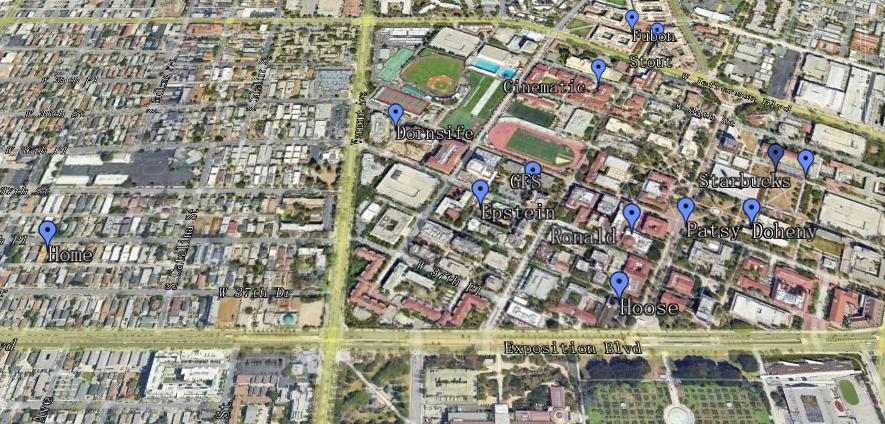
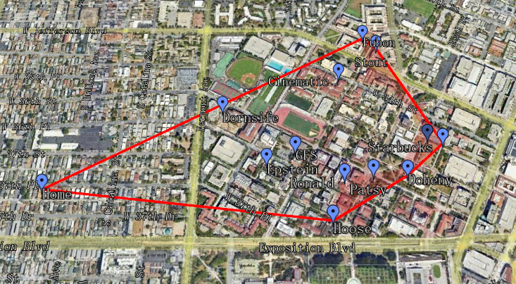
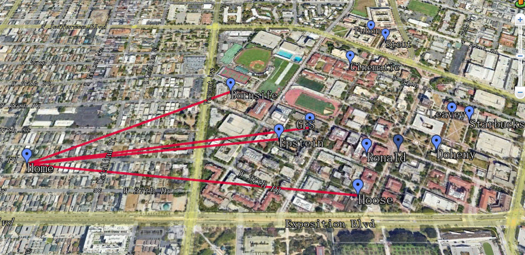
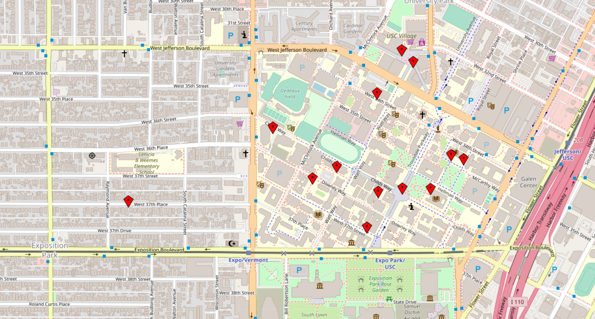
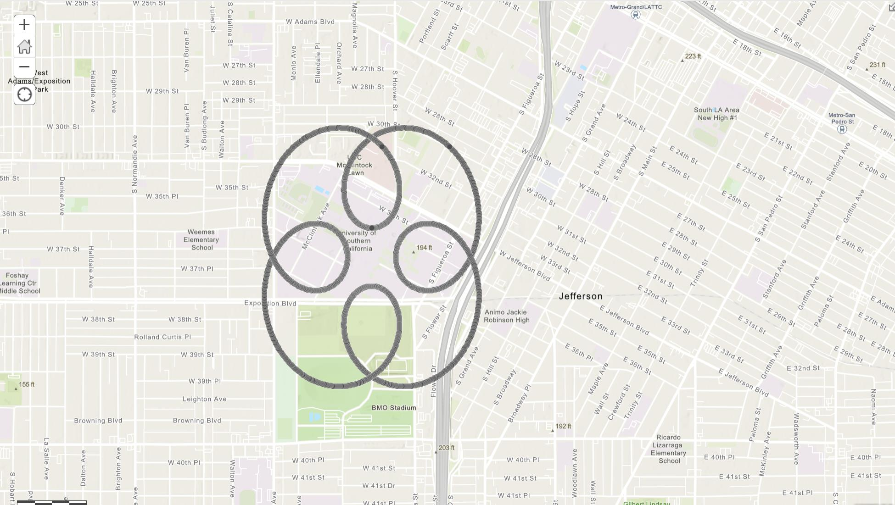

This project was generated in CSCI 585 class at USC, where we recorded the 13 coordinates -- 3 for libraries, 3 for department buildings, 3 for eateries, 3 for fountains and 1 for my home. The former 12 are in USC campus. 

To show there coordinates, I set these coordinates in a .kml file, which can display the coordinates integrating the real map. Placemarks like below. And I run .kml with Google Earth Pro.(/placemarks/code.kml)

To compute the convex hull and  the nearest neighbor line, I averaged PostgreSQL, using the create-table commands and queries commands.(Code can be seen on /placemarks/queries.sql)
Then, I showed the results through writing kml code and running on Google Earth Pro, like below.

In Addition, I used Javascript to build a .html file to show these 13 coordinates on browser, like below. (/placemarks/placemarks.html)

The second part is to write a Spirograph centering on Tommy Trajon. I wrote the Python script to compute all the coordinates and then generated a spiro.kml. Then I used [mygeodata](https://mygeodata.cloud/converter/kml-to-shp) to  convert the KML to an ESRI 'shapefile', and used [ArcGIS](https://www.arcgis.com/home/webmap/viewer.html?useExisting=1) to visualize the shapefile data. Showed below.(/spiro)

